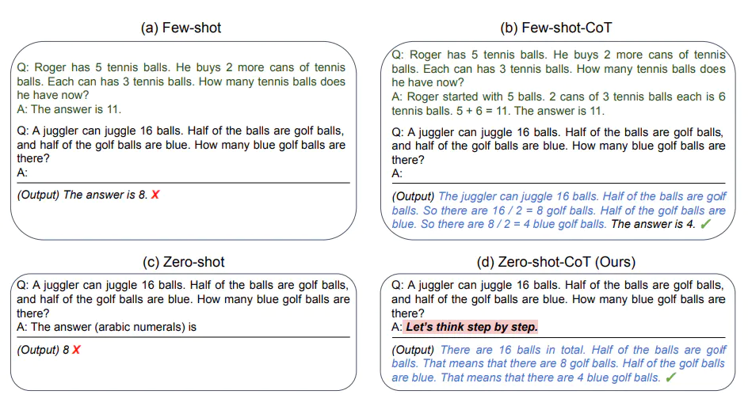

# Chain-of-Thought Prompting

# 链式思考（COT）

Chain of thought prompting 是一种简单且广泛适用的方法，可提高语言模型执行各种推理任务的能力。通过对算术和常识推理的实验，我们发现思维链式启发是模型规模的一种新兴属性。

在 Google 2023.01 的论文 [Chain-of-Thought Prompting Elicits Reasoning in Large Language Models](../../%E5%8F%82%E8%80%83%E6%96%87%E6%A1%A3%E5%90%88%E9%9B%86/google-chain-of-thought-paper)  中对于三个大型语言模型上的实验表明，思考链提示改善了一系列算术、常识和符号推理任务的性能。具体效果如下：


图1：思维链提示使得大型语言模型能够解决复杂的算术、常识和符号推理任务。思维链推理过程被突出显示。

从上图的例子中可以看到，本来在左侧提出问题，大语言模型算出来的答案是错误的，而当我们在 Prompt 中的例子里加入推导出答案的逻辑过程的文案后，大语言模型竟然神奇地能够给出正确答案。

这个给出逻辑推理过程示例就能让大语言模型能力提升的方法被称为 Chain of Thought Prompting。也就是我们可以在 Prompt 中提供推理步骤的示例后，得到大语言模型更好的结果。

例如提示可以是：

```jsx
这组数中的奇数加起来是偶数：4、8、9、15、12、2、1。
A：将所有奇数相加（9、15、1）得到25。答案为False。
这组数中的奇数加起来是偶数：15、32、5、13、82、7、1。
A：
```

这个时候大语言模型就可以输出：

```jsx
将所有奇数相加（15、5、13、7、1）得到41。答案为False。
```

而且谷歌团队发现，不仅是上面例子中的算术推理，在涉及常识推理、符号推理等多种推理时，COT Prompting 都能够在不同程度上提升大语言模型的表现。（详情可见本文末闪闪团队翻译的论文中文版，不需要深厚的机器学习背景也可以阅读，非常建议所有朋友尝试）

# 零样本 COT Prompt

基于谷歌团队的研究成果，在另一篇 [Large Language Models are Zero-Shot Reasoners](https://arxiv.org/abs/2205.11916) 的论文中发现了 Prompt 的黄金语句，连一个案例都不用给它，即

```jsx
Let's think step by step.
```



**输入**：

```
我去市场买了10个苹果。我给了邻居2个苹果和修理工2个苹果。然后我去买了5个苹果并吃了1个。我还剩下多少苹果？
```

**输出**：

```
11个苹果
```

答案是不正确的！现在让我们尝试使用特殊提示。

**输入**：

```
我去市场买了10个苹果。我给了邻居2个苹果和修理工2个苹果。然后我去买了5个苹果并吃了1个。我还剩下多少苹果？ Let's think step by step.
```

**输出**：

```jsx
首先，您从10个苹果开始。您给了邻居和修理工各2个苹果，所以您还剩下6个苹果。然后您买了5个苹果，所以现在您有11个苹果。最后，您吃了1个苹果，所以您还剩下10个苹果。
```

**神奇的是，这个简单的提示马上就奏效了，大语言模型给出了更好的表现**。

更多阅读：

[谷歌：链式思维提示(COT Prompting)引发大型语言模型的推理](../../%E5%8F%82%E8%80%83%E6%96%87%E6%A1%A3%E5%90%88%E9%9B%86/google-chain-of-thought-paper)